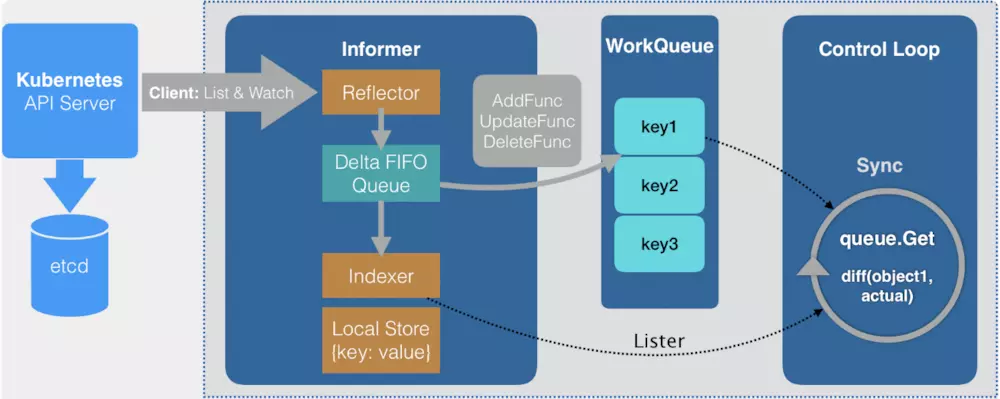

# Custom resource controller

[example](https://github.com/kubeflow/pytorch-operator)

├── pkg
│   ├── apis
│   │   └── pytorch
│   │   ├── v1
│   │   │   ├── constants.go
│   │   │   ├── defaults.go
│   │   │   ├── doc.go
│   │   │   ├── register.go
│   │   │   ├── types.go
│   │   │   ├── zz_generated.deepcopy.go
│   │   │   └── zz_generated.defaults.go
│   │   ├── v1beta2
│   │   └── validation
│   ├── client
│   │   ├── clientset
│   │   │   └── versioned
│   │   │   ├── clientset.go
│   │   │   ├── doc.go
│   │   │   ├── fake
│   │   │   ├── scheme
│   │   │   │   ├── doc.go
│   │   │   │   └── register.go
│   │   │   └── typed
│   │   │   └── pytorch
│   │   │   ├── v1
│   │   │   │   ├── doc.go
│   │   │   │   ├── fake
│   │   │   │   │   ├── doc.go
│   │   │   │   │   ├── fake_pytorch_client.go
│   │   │   │   │   └── fake_pytorchjob.go
│   │   │   │   ├── generated_expansion.go
│   │   │   │   ├── pytorch_client.go
│   │   │   │   └── pytorchjob.go
│   │   │   └── v1beta2
│   │   ├── informers
│   │   │   └── externalversions
│   │   │   ├── factory.go
│   │   │   ├── generic.go
│   │   │   ├── internalinterfaces
│   │   │   │   └── factory_interfaces.go
│   │   │   └── pytorch
│   │   │   ├── interface.go
│   │   │   ├── v1
│   │   │   │   ├── interface.go
│   │   │   │   └── pytorchjob.go
│   │   │   └── v1beta2
│   │   │   ├── interface.go
│   │   │   └── pytorchjob.go
│   │   └── listers
│   │   └── pytorch
│   │   ├── v1
│   │   │   ├── expansion_generated.go
│   │   │   └── pytorchjob.go
│   │   └── v1beta2
│   │   ├── expansion_generated.go
│   │   └── pytorchjob.go
│   ├── common
│   │   ├── config
│   │   │   └── config.go
│   │   └── util
│   │   ├── v1
│   │   └── v1beta2
│   ├── controller.v1
│   │   └── pytorch
│   ├── controller.v1beta2
│   │   └── pytorch
│   └── util
│   ├── util.go
│   └── util_test.go

## apis

- type.go: resource struct
- register.go: 目的是产生 AddToScheme，其作用是向 scheme 中注册内容,主要注册的内容包括:
  - addKnownType: 向 scheme 中添加 operator 中定义的资源
  - addDefaultFunc: 添加 operator 中定义的资源的默认函数，创建此资源，要使用这个函数，来规范资源或者添加某些默认定义
- default.go: addDefaultFunc 定义

## client

### clientset

创建资源的 clientset

1. 拓展 rest.Interface，加入 Get、List、Watch 等函数
2. 定义 resource client 结构体，使符合上述 interface
3. 添加 NewForConfig 函数，来拿到 client 结构体

如果有多个版本，创建统一的结构体，包含各个版本的 client 和 register 的相关内容，将每个版本的 AddToScheme 加到 SchemeBuild 儿中。(clientset/versioned/scheme)

fake 相关名字的文件夹是用来测试用的

### informers

